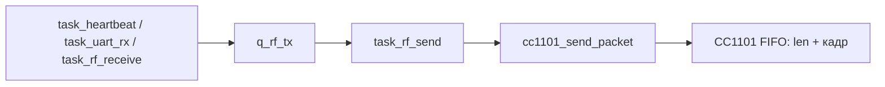
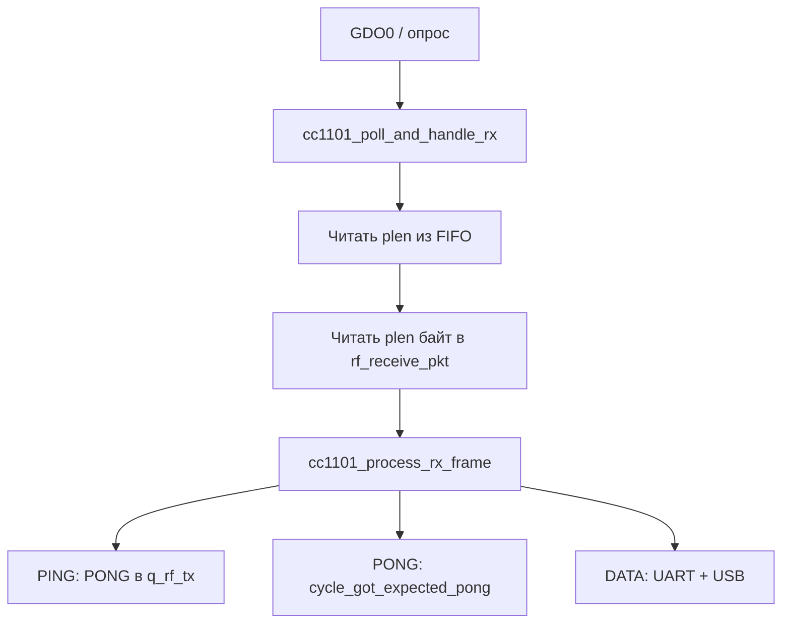
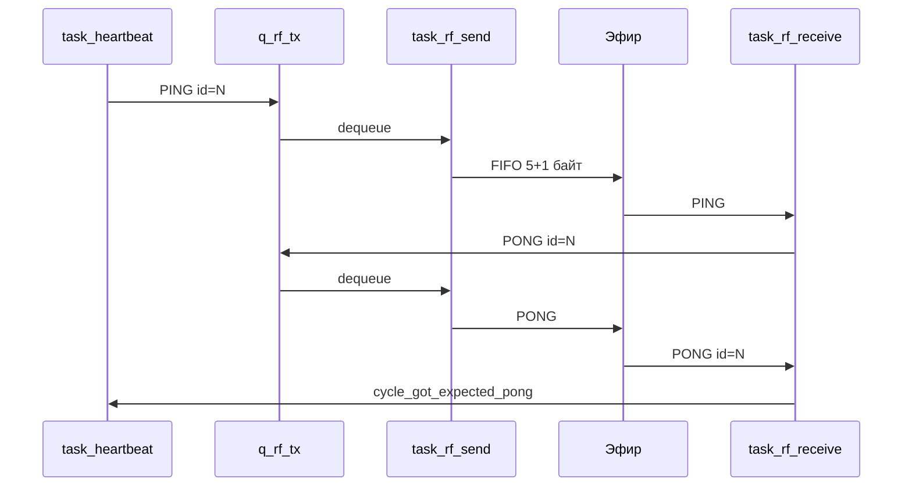

# radio_extender

Прошивка моста **USB/UART ↔ CC1101 (433 МГц)** на AT32F415 + ThreadX.  
Один формат кадра протокола для всех типов; длина на эфире **переменная** (5…64 байта).

---

## Формат кадра протокола (общий)

Сборка: `Protocol_BuildPacket()` (`src/protocol.c`).  
Разбор: `Protocol_ParsePacket()`.

| Смещение | Поле | Размер | Описание |
|----------|------|--------|----------|
| 0 | `LEN` | 1 | `3 + размер_полезной_нагрузки` |
| 1 | `ID` | 1 | Идентификатор кадра |
| 2 | `TYPE` | 1 | Тип пакета |
| 3 … | `DATA` | 0…N | Полезная нагрузка |
| `LEN` … `LEN+1` | `CRC16` | 2 | CRC над байтами `0 … LEN-1` |

**CRC:** полином `0x1021`, init `0xFFFF`, в кадре старший байт первым.

**Размер кадра в буфере / для очереди `q_rf_tx`:**

```
pkt_len = LEN + 2        /* от 5 до PROTO_MAX_PACKET (64) */
```

**Типы (`protocol.h`)**

| Значение | Имя | Назначение |
|----------|-----|------------|
| `0x00` | `PROTO_TYPE_DATA` | Данные пользователя |
| `0x01` | `PROTO_TYPE_PING` | Проверка связи (запрос) |
| `0x02` | `PROTO_TYPE_PONG` | Ответ на PING |

---

## Передача по CC1101 (переменная длина)

Режим чипа: **`CC1101_ApplyVariablePacketMode()`**

| Регистр | Значение | Смысл |
|---------|----------|--------|
| `PKTCTRL0` | `0x01` | Variable packet length |
| `PKTCTRL1` | `0x00` | Без CRC/status append модема |
| `PKTLEN` | `64` | Максимальная длина полезного поля FIFO |

CRC по эфиру — только в `protocol.c` (модемный CRC выключен).

### Структура в FIFO при TX/RX

```
┌──────────────┬─────────────────────────────────────┐
│ CC1101 len   │  Кадр протокола (pkt_len байт)     │
│  (1 байт)    │  [LEN][ID][TYPE][DATA…][CRC16]     │
└──────────────┴─────────────────────────────────────┘
```

- **`CC1101 len`** = `pkt_len` = `LEN + 2` (размер кадра протокола).
- В **TX** (`cc1101_send_packet`): в FIFO пишется `len`, затем `pkt[0 … len-1]`.
- В **RX** (`cc1101_poll_and_handle_rx`):
  1. Читается байт `plen` из FIFO.
  2. Проверка: `RF_LINK_PKT_LEN ≤ plen ≤ PROTO_MAX_PACKET`.
  3. Проверка: `RXBYTES ≥ plen + 1` (кадр целиком в FIFO).
  4. Читается `plen` байт в `rf_receive_pkt`.
  5. Проверка: `rf_receive_pkt[0] + 2 == plen`.

`CC1101_ApplyLinkPacketMode()` — обёртка над `ApplyVariablePacketMode()` (совместимость).

---

## Режим связи (PING / PONG)

Кадр протокола **ровно 5 байт** (`RF_LINK_PKT_LEN`). На эфире в FIFO: **1 + 5 = 6 байт** (`CC1101 len = 5`).

### PING

| Байт | Значение | Пример (`id = 5`) |
|------|----------|-------------------|
| 0 | `0x03` | `03` |
| 1 | `id` | `05` |
| 2 | `0x01` | `01` |
| 3–4 | CRC16 | `.. ..` |

### PONG

`TYPE = 0x02`, **`id` = id из PING**.

### Логика `id` и LED

- Каждая плата: `ping_seq` 1…255 → **PING** с `id = N`, ожидается **PONG** с `id = N` (`expect_pong_id`).
- **Зелёный LED:** 3 подряд цикла (~1 с) с `RF rx PONG id=N` (`RF_PONG_OK_CYCLES = 3`).
- **Красный:** нет PONG в цикле → `missed_pings`; после 2 пропусков — `RF link lost`.
- Watchdog: `link_liveness` без подтверждённого PONG в цикле.

### Фильтры на PING (антиспам)

| Константа | Действие |
|-----------|----------|
| `RF_OWN_PING_ECHO_MS` (25 ms) | Не отвечать на эхо своего PING |
| `RF_PING_DEDUPE_MS` (800 ms) | Не отвечать на тот же `id` повторно |
| Устаревший `id` | PING «старше» последнего от соседа — игнор |

При приёме PING/PONG дополнительно: `pkt_len == 5`.

---

## Основной режим (DATA)

Тот же заголовок; **полезная нагрузка 1…59 байт** (`LEN` от `0x04` до `0x3C`).

### Пример (4 байта данных `"ABCD"`)

| Байт | Значение |
|------|----------|
| 0 | `0x07` |
| 1 | `0x00` |
| 2 | `0x00` |
| 3–6 | `41 42 43 44` |
| 7–8 | CRC16 |

`pkt_len = 9`. В FIFO CC1101: `[09][07 00 00 41 42 43 44 CRC CRC]`.

При приёме: `pkt_len > 5`, `TYPE == DATA` → payload в UART и USB CDC (`cdc_send_frame` с полным `pkt_len`).

---

## Задачи и очереди

| Задача | Приоритет* | Роль |
|--------|------------|------|
| `task_heartbeat` | 6 | PING → `q_rf_tx`, LED, sleep 1 с |
| `task_rf_send` | 7 | **Единственная** передача в CC1101 |
| `task_rf_receive` | 9 | Приём FIFO, разбор кадров |
| `task_uart_rx` | 10 | UART → `q_rf_tx` (только DATA) |
| `usb_task` | — | USB CDC |

\*ThreadX: **меньшее число = выше приоритет**.

### Очередь `q_rf_tx`

- Глубина **8**, элемент **64 байта** (весь кадр протокола).
- Постановка: `rf_tx_enqueue(pkt, pkt_len)` / `rf_tx_enqueue_link(id, type)`.
- Условие: `pkt[0] + 2 == pkt_len`, `5 ≤ pkt_len ≤ 64`.
- Передача: только `task_rf_send` → `cc1101_send_packet(pkt, pkt_len)`.

### Мьютекс `cc1101_mutex`

Защищает SPI/CC1101. **Не** вызывать `cc1101_send_packet` из heartbeat/receive — только очередь.

---

## Алгоритм работы

### Передача (любой тип)



1. Источник формирует кадр (`Protocol_BuildPacket` или буфер с UART).
2. `rf_tx_enqueue()` → `q_rf_tx`.
3. `task_rf_send` блокируется на `tx_queue_receive(TX_WAIT_FOREVER)`.
4. `cc1101_send_packet`: SIDLE → SFRX/SFTX → variable mode → FIFO `[pkt_len][pkt…]` → STX → RX.

### Приём



1. `task_rf_receive`: при GDO0 — `cc1101_poll_and_handle_rx()`, иначе `sleep(5)`.
2. Разбор по `TYPE`; PING → **PONG в очередь** (не прямая передача).
3. `task_heartbeat` в цикле 1 с проверяет `cycle_got_expected_pong` и LED.

### Обмен двух плат (линк)



### Цикл `task_heartbeat` (~1 с)

1. `ping_seq++`, `expect_pong_id = ping_seq`, `cycle_got_expected_pong = 0`.
2. `rf_tx_enqueue_link(PING)`.
3. `tx_thread_sleep(1000)` — приём в `task_rf_receive`.
4. Если был PONG с `id == expect_pong_id` → `pong_ok_streak++`, при ≥3 → `link_mark_ok()`.
5. Иначе — `link_liveness` / `missed_pings` / `link_mark_lost()`.

### Цикл `task_uart_rx`

1. Сборка кадра по UART: байт0=`LEN`, всего `LEN+2` байт.
2. `Protocol_ParsePacket`, при `TYPE==DATA` → `tx_queue_send(&q_rf_tx, uart_rx_buf)`.

### Сдвиг фазы PING

`100 + (UID % 500)` мс перед первым PING (`rf_ping_phase_ms()`).

---

## Радио

- **433 МГц** (`FREQ2/1/0`, `SYNC1` в `cc1101.c`).
- SPI: MSB/CPHA0, делитель /128 (автопоиск).
- После TX: `SFRX` + `SRX` (`CC1101_ListenAfterTx`).
- Лог UART **115200**.

---

## Сборка

IAR: `radio_extender.ewp`. Обе платы — **одна сборка**.

---

## Сообщения в логе

| Сообщение | Значение |
|-----------|----------|
| `RF PING q id=N` | PING в очереди |
| `RF tx id=N type=01/02/00` | Передан кадр (тип в hex) |
| `RF rx PING id=N -> PONG q` | PING принят, PONG в очереди |
| `RF rx PONG id=N` | Ожидаемый PONG |
| `RF link OK` / `RF link lost` | Состояние линка |
| `RF tx queue full` | Очередь переполнена |
